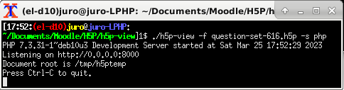
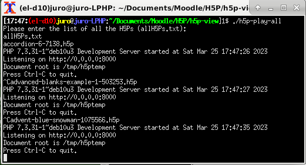

**(Before using this bash script, note that a convenient way to view H5Ps is probably by using a free H5P viewer/editor app such as [Lumi](https://app.lumi.education/).)**

# h5p-view  
[h5p-view](https://github.com/justineuro/h5p-view) is a bash script that processes (through a linux command line), for viewing/playing, [H5P](https://h5p.org/getting-started) zipped files by implementing [h5p-standalone](https://github.com/tunapanda/h5p-standalone).  
This bash script 

* needs a `-f` option to indicate the H5P filename to be viewed/played;
* needs a `-s` option to indicate whether php or python is used for runninng the server (python or php); and 
* creates a temporary folder (`/tmp/h5ptemp`), as a server root directory from which it is run.

(The server is started either as `php -S 0.0.0.0:8000` or `python -m http.server`.)  

## Instructions on use
To use,

* Clone this repository: `git clone https://github.com/justineuro/h5p-view.git`
* At a linux command line within your `h5p-view` directory issue the command:
```sh
./h5p-view -f <name-of-H5P-file> -s <server starter: python or php>
```
* Point your browser at `http://0.0.0.0:8000` to play the H5P.

For example, to view/play the [H5P Quiz (Question Set) example](https://h5p.org/question-set) from the [Examples and Downloads](https://h5p.org/content-types-and-applications) page at https://h5p.org and use `python -m http.server` to start the server:
```sh
./h5p-view -f question-set-616.h5p -s python
```
The H5P can now be viewed/played at `http://0.0.0.0:8000`. 
Use `Ctrl-C` to stop the server; the script consequently removes the temporary files in the `/tmp/h5ptemp` folder.  

  
## Contents of this repositoty
This folder includes (among others):
  
* [`h5p-view`](./h5p-view) or [`h5p-play`](./h5p-play) - a bash script to start create the server for playing the H5P file.
* [`dist`](./dist) - a folder (and very important resource) from the [h5p-standalone](https://github.com/tunapanda/h5p-standalone) distribution that contains the essential files that allow the H5P content to be rendered in a standalone HTML page (i.e., independent of a platform such as certain Learning Management Systems (LMSs)).  
* [`h5p-all92-check.txt`](./h5p-all92-check.txt)- a checklist containing information regarding  
  * the 92 H5P examples that are avaliable from [h5p.org's Examples and Downloads](https://h5p.org/content-types-and-applications) page as of 2024-February-26 and 
  * the success of this script in playing each of these 92 H5P examples. (Note that there are two versions of `Impressive Presentation`; one version has both the `FontAwesome-4.5` and `FontAwesome-4.3` folders. Also, the script fails on four H5Ps: `AR Scavenger`, `Audio Recorder`, `Dialog Cards`, and one example of `Game Map`.)
* [`h5p-view-all`](./h5p-view-all) or [`h5p-play-all`](./h5p-play-all) - a bash script that allows you to view/play all the 93 H5P examples in this repository; simply use `Ctrl-C` at the command line to end the current example and restart the server for the next H5P example in this directory.  


<a rel="license" href="http://creativecommons.org/licenses/by/4.0/"></a><br /><span xmlns:dct="http://purl.org/dc/terms/" property="dct:title">h5p-view</span> by <a xmlns:cc="http://creativecommons.org/ns#" href="https://github.com/justineuro/" property="cc:attributionName" rel="cc:attributionURL">Justine Leon A. Uro</a> is licensed under a <a rel="license" href="http://creativecommons.org/licenses/by/4.0/">Creative Commons Attribution 4.0 International License</a>.<br />Based on a work at <a xmlns:dct="http://purl.org/dc/terms/" href="https://github.com/justineuro/h5p-view" rel="dct:source">https://github.com/justineuro/h5p-view</a>.
